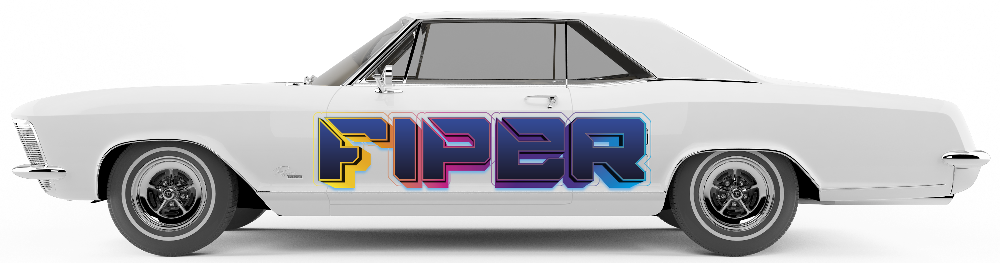

# `FIPER`

#### Site com informações atualizadas com valores de referência de veículos utilizando a API [Deivid Fortuna](https://deividfortuna.github.io/fipe/).

# `Link`

https://fiper.vercel.app/

###### O site tem suporte "adicionar a tela inicial" ou "Instalar PWA" (Progressive Web App).

# `Descrição`

###### O site criado é uma aplicação web de informações úteis sobre a tabela FIPE (Fundação Instituto de Pesquisas Econômicas).

###### O site oferece uma experiência intuitiva, permitindo aos usuários obter informações de:

#### Ações e Criptomoedas:

- Marca;
- Modelo;
- Ano;
- Combustível;
- Valor;
- Código FIPE;
- Mês de referência

#### Informações úteis de:

- O que é a tabela FIPE;
- Placas;
- Detran;
- Denatran;
- Links úteis (Sites e telefones da Polícia Federal (PF), Polícia Rodoviária Federal (PRF), Polícia Civil (PC) e Polícia Militar (PM) de todos os estados brasileiros).

O repositório do projeto pode ser encontrado [aqui](https://github.com/marleopr/fipe)

| Tela de inicial                      | Página de erro                         |
| ------------------------------------ | -------------------------------------- |
|  |   |
| Pesquisa FIPE                        | FIPE pesquisada                        |
|      |  |
| Informações úteis                    | Informações úteis                      |
|      |    |

# `Passo a Passo para Instalação do Projeto React:`

##### Pré-requisitos:

Certifique-se de ter o Node.js e o npm (ou yarn) instalados em sua máquina. Você pode baixá-los em https://nodejs.org/.
Git instalado em sua máquina. Você pode baixá-lo em https://git-scm.com/.

##### Clone o Repositório:

Abra o terminal (ou Git Bash) e navegue até o diretório onde deseja clonar o projeto.
Execute o comando: git clone https://github.com/marleopr/fipe.git

##### Acesse o Diretório do Projeto:

Navegue até o diretório do projeto: cd nome-do-repositorio

##### Instale as Dependências:

Execute o comando: npm install
Este comando irá instalar todas as dependências listadas no arquivo package.json.
Configure as Variáveis de Ambiente (se necessário):

##### Execute o Projeto:

Após instalar as dependências, inicie o servidor de desenvolvimento com o comando: npm start
O projeto será executado e estará disponível em http://localhost:3000 no seu navegador.

##### Personalize o Projeto:

Agora você pode personalizar o projeto de acordo com suas necessidades, fazendo alterações nos arquivos do diretório "src".
Construa o Projeto (Opcional):

Se desejar criar uma versão otimizada do projeto para implantação, execute o comando: npm run build
Isso criará uma pasta "build" com os arquivos otimizados para produção.
Implante o Projeto (Opcional):

Você pode implantar o projeto em um servidor web ou em plataformas de hospedagem, como GitHub Pages, Vercel, Netlify, entre outros.

# `Organização do código`

##### Eu optei por organizar o projeto dividindo em pastas:

- Assets: Contém todas as imagens necessárias ao site.
- Components: Contém os loaders, botões, Cards e componentes utilizados:
- - ButtonAll.js: Botão Chakra UI estilizado.
- - DownloadButton.js: Componente do botão estilizado para instalação via PWA.
- - EasterEgg.js: Função para apresentar uma mensagem secreta no console de desenvolvimento.
- - FipeCard.js: Card que renderiza dados requisitados da API.
- - Footer.js: Componente de rodapé.
- - Header.js: Componente de cabeçalho.
- - RadioButtons.js: Componente do botão menu da tela inicial.
- - RadioCyberButton.js: Componente do botão menu da tela inicial.
- - RadioTipos.js: Componente do botão de escolhe do tipo de veículo.
- - Styled.css: Arquivo contendo todas as estilizações CSS presentes no site.
- - WheelLoader.js: Animação personalizada mostrada quando não há dados solicitados.
- Constants:
- - BASE_URL.js: Contém a base da API utilizada.
- - colors.js: Arquivo para padronização de cores do site.
- - theme.css: Arquivo CSS para padronização de cores do site.
- - theme.js: Arquivo para padronização de cores do Chakra com extendTheme.
- Pages:
- - ErrorPage.js: Página de erro.
- - HomePage.js: Componente da tela inicial.
- - Info.js: Componente de informações úteis.
- - SearchTabela.js: Componente de pesquisa FIPE.
- Routes:
- - Cordinator / Router: Componentes do React Router Dom.

# `Tecnologias utilizadas`

# `Autor`

#### [Márleo Piber da Rosa](https://github.com/marleopr)

